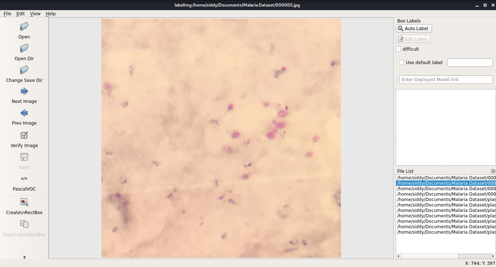
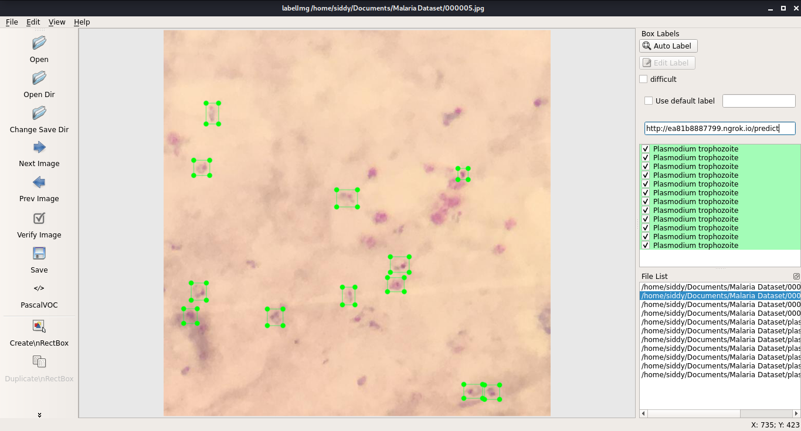

Malaria LabelImg
================

This is a customized annonation tool created from LabelImg.

LabelImg is a graphical image annotation tool.

It is written in Python and uses Qt for its graphical interface.

Annotations are saved as XML files in PASCAL VOC format, the format used
by `ImageNet <http://www.image-net.org/>`__.

.. image:: https://raw.githubusercontent.com/tzutalin/labelImg/master/demo/demo3.jpg
     :alt: Demo Image
     
|Before annotation|
|------|
||

|After annotation|
|------|
||


Requirements
------------------

    - Python >= 3.6(Conda)
    - PyTorch >=1.3
    - torchvision that matches the PyTorch installation. You can install them together at pytorch.org to make sure of this
    - OpenCV, needed by demo and visualization
    - Fvcore


Installation (Get from PyPI)
------------------
.. code::

    pip install -U torch torchvision
    pip install git+https://github.com/facebookresearch/fvcore.git
    pip install 'git+https://github.com/facebookresearch/detectron2.git'
    
    *clone malaria labelImg repo  
    navigate to the repo directory
    run 'python malaria labelImg'
    
   
Usage
-----

Steps 
~~~~~

1. Install and launch using the instructions above.
2. Click 'Change default saved annotation folder' in Menu/File
3. Click 'Open Dir'
4. Fill url to the deployed model and Click auto label for labelling using a deep learning model
5. Or Click 'Create RectBox' for manual labeling
6. Then click and release left mouse to select a region to annotate the rect
   box
7. You can use right mouse to drag the rect box to copy or move it

The annotation will be saved to the folder you specify.

You can refer to the below hotkeys to speed up your workflow.

~~~~~~~~~~~~~~~~~~~~~~~~~~


Hotkeys
~~~~~~~

+------------+--------------------------------------------+
| Ctrl + u   | Load all of the images from a directory    |
+------------+--------------------------------------------+
| Ctrl + r   | Change the default annotation target dir   |
+------------+--------------------------------------------+
| Ctrl + s   | Save                                       |
+------------+--------------------------------------------+
| Ctrl + d   | Copy the current label and rect box        |
+------------+--------------------------------------------+
| Space      | Flag the current image as verified         |
+------------+--------------------------------------------+
| w          | Create a rect box                          |
+------------+--------------------------------------------+
| d          | Next image                                 |
+------------+--------------------------------------------+
| a          | Previous image                             |
+------------+--------------------------------------------+
| del        | Delete the selected rect box               |
+------------+--------------------------------------------+
| Ctrl++     | Zoom in                                    |
+------------+--------------------------------------------+
| Ctrl--     | Zoom out                                   |
+------------+--------------------------------------------+
| ↑→↓←       | Keyboard arrows to move selected rect box  |
+------------+--------------------------------------------+

~~~~~~~~~~~~~~~~~~~~~~~~~~

License
~~~~~~~
[GNU General Public License v3.0](https://github.com/malariacheker/annonataton_tool/blob/main/LICENSE)

~~~~~~~~~~~~~~~~~~~~~~~~~~

Citation: 
~~~~~~~
Tzutalin. LabelImg. Git code (2015). https://github.com/tzutalin/labelImg


```BibTeX
@misc{wu2019detectron2,
  author =       {Yuxin Wu and Alexander Kirillov and Francisco Massa and
                  Wan-Yen Lo and Ross Girshick},
  title =        {Detectron2},
  howpublished = {\url{https://github.com/facebookresearch/detectron2}},
  year =         {2019}
}
```
